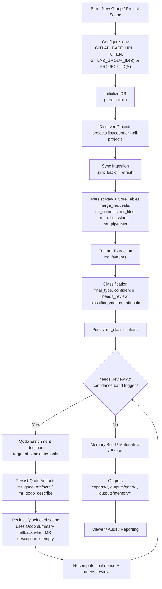

# prtool

Python CLI for GitLab Merge Request analysis with SQLite storage, infra-aware type classification, and complexity scoring.

## Single MR Context (New)

Use this command when you want one rich markdown context for a specific MR (for handoff/review/history).

Execution order in one command:
1. Render rich context markdown from SQLite (fast default)
2. Optional Qodo run for the MR (`describe` by default, configurable)
3. Optional targeted reclassification for the same MR

Examples:

```bash
prtool mr-context --project-id 123 --mr-iid 456
prtool mr-context --project-id 123 --mr-iid 456 --qodo-inline --reclassify
prtool mr-context --mr-url https://gitlab.example/org/repo/-/merge_requests/456 --qodo-tools describe,review
prtool mr-context --project-id 123 --mr-iid 456 --no-qodo-inline --no-reclassify
```

Default output path:

```text
outputs/mr_context/mr_context_<project_id>_<mr_iid>.md
```

Key options:
- `--project-id` + `--mr-iid` or `--mr-url` (pick one method)
- `--qodo-inline/--no-qodo-inline` (default: off)
- `--reclassify/--no-reclassify` (default: off)
- `--qodo-tools describe,review,improve`
- `--out-path` to override output location

## Quick start

```bash
# prtool runtime
python3 -m venv .venv
source .venv/bin/activate
pip install -e .

# qodo/pr-agent runtime (kept separate to avoid dependency conflicts)
python3 -m venv .venv-qodo
source .venv-qodo/bin/activate
pip install -r requirements-enrich.txt
deactivate

# initialize DB with prtool runtime
source .venv/bin/activate
prtool init-db
```

`PyYAML` is included in base `prtool` dependencies, so YAML payload parsing in `enrich` works in CI and local installs without extra steps.

You can use a `.env` file (auto-loaded by `prtool`). Start from `.env.example`:

```bash
cp .env.example .env
```

Set environment variables (this is where PAT goes):

- `GITLAB_BASE_URL`
- `GITLAB_TOKEN`  <- put your GitLab PAT here
- `GITLAB_PROJECT_ID` (single project) or `GITLAB_PROJECT_IDS` (comma-separated multiple projects)
- `GITLAB_GROUP_ID` / `GITLAB_GROUP_IDS` (optional: restrict discovery to specific group(s))
- `DB_PATH` (default `./pr_analysis.db`)
- `QODO_DESCRIBE_CMD` (required for `enrich qodo`/inline qodo; must include `{mr_url}`; use `--config.publish_output=false` for read-only mode)
- `QODO_REVIEW_CMD` / `QODO_IMPROVE_CMD` (optional overrides for multi-tool runs)

Example:

```bash
export GITLAB_BASE_URL="https://gitlab.com"
export GITLAB_TOKEN="glpat-xxxxxxxxxxxxxxxx"
export GITLAB_PROJECT_IDS="12345678,23456789,34567890"
export GITLAB_GROUP_ID="your-org/your-group"
export QODO_DESCRIBE_CMD=".venv-qodo/bin/python -m pr_agent.cli --pr_url={mr_url} describe --config.publish_output=false --pr_description.publish_labels=false --config.verbosity_level=2"
# Optional overrides:
# export QODO_REVIEW_CMD=".venv-qodo/bin/python -m pr_agent.cli --pr_url={mr_url} review --config.publish_output=false --config.verbosity_level=2"
# export QODO_IMPROVE_CMD=".venv-qodo/bin/python -m pr_agent.cli --pr_url={mr_url} improve --config.publish_output=false --config.verbosity_level=2"
export DB_PATH="./pr_analysis.db"
```

Optional infra config:

- `INFRA_TICKET_REGEX` (default `INFRA-\\d+,OPS-\\d+`)
- `INFRA_LABEL_ALLOWLIST` (default `infra,platform,devops,sre`)
- `INFRA_KEYWORD_LIST`
- `INFRA_STRONG_THRESHOLD` (default `4.0`)
- `INFRA_WEAK_THRESHOLD` (default `1.5`)
- `CLASSIFICATION_NEEDS_REVIEW_THRESHOLD` (default `0.75`, below this confidence => `needs_review=true`)
- `QODO_INLINE_ENABLED` (default `false`; run threshold-Qodo inline during `reclassify`)
- `QODO_TRIGGER_MIN_CONF` / `QODO_TRIGGER_MAX_CONF` (defaults `0.70` / `0.75`)
- `QODO_TRIGGER_REASONS` (default `missing_description,low_top2_margin`)
- `QODO_REQUIRE_EMPTY_DESCRIPTION` (default `false`)
- `QODO_INLINE_CONCURRENCY` (default `5`)
- `QODO_INLINE_TIMEOUT_SEC` (default `180`)

## Recommended runtime sequence

```bash
# load .env once per shell
set -a
source .env
set +a

# run prtool using .venv
source .venv/bin/activate

# classifier-only flow
prtool reclassify --all-projects --force

# classifier + inline qodo flow
prtool reclassify --all-projects --force --qodo-inline
```

If you hit qodo timeouts, increase timeout and reduce concurrency:

```bash
export QODO_INLINE_TIMEOUT_SEC=420
export QODO_INLINE_CONCURRENCY=3
prtool reclassify --all-projects --force --qodo-inline
```

## Troubleshooting

### Qodo fails with `ModuleNotFoundError: No module named 'pr_agent'`

Symptom in `mr_qodo_runs.stderr_excerpt`:

```text
Error while finding module specification for 'pr_agent.cli'
```

Fix:

```bash
# ensure qodo runtime exists and has dependencies
python3 -m venv .venv-qodo
source .venv-qodo/bin/activate
pip install -r requirements-enrich.txt
deactivate

# ensure .env uses qodo runtime interpreter
export QODO_DESCRIBE_CMD=".venv-qodo/bin/python -m pr_agent.cli --pr_url={mr_url} describe --config.publish_output=false --pr_description.publish_labels=false --config.verbosity_level=2"
```

Also clear stale shell vars before reloading `.env`:

```bash
unset QODO_DESCRIBE_CMD QODO_REVIEW_CMD QODO_IMPROVE_CMD
set -a; source .env; set +a
```

### Qodo fails with timeout (`timeout after 180s`)

Symptom in `mr_qodo_runs.stderr_excerpt`:

```text
timeout after 180s
```

Fix by increasing timeout and lowering concurrency:

```bash
export QODO_INLINE_TIMEOUT_SEC=420
export QODO_INLINE_CONCURRENCY=3
prtool reclassify --all-projects --force --qodo-inline
```

### Validate current qodo health quickly

```bash
sqlite3 pr_analysis.db "SELECT tool, status, COUNT(*) FROM mr_qodo_runs GROUP BY tool, status ORDER BY tool, status;"
sqlite3 pr_analysis.db "SELECT COUNT(*) FROM mr_qodo_artifacts WHERE tool='describe';"
```

For leaked/disabled API key response steps, see:
`docs/security_incident_response.md`

Commands:

```bash
prtool list-projects --project-start-index 1 --project-count 10
prtool list-projects --group-id your-org/your-group --project-start-index 1 --project-count 10
prtool projects count --all-projects
prtool projects count --group-id your-org/your-group
prtool projects count --group-id your-org/your-group --format json --include-ids
prtool projects list --all-projects --format json
prtool sync backfill --project-id 123 --project-id 456 --since 2025-01-01
prtool sync refresh --project-id 123 --project-id 456
prtool sync refresh --all-projects
prtool sync refresh --group-id your-org/your-group
prtool sync refresh --group-id your-org/your-group --concurrency 5
prtool sync refresh --group-id your-org/your-group --light-mode
prtool sync refresh --all-projects --project-start-index 1 --project-count 1
prtool sync refresh --all-projects --project-start-index 2 --project-count 5
prtool classify --project-id 123 --project-id 456
prtool classify --group-id your-org/your-group
prtool classify --all-projects
prtool classify --all-projects --project-start-index 2 --project-count 5
prtool reclassify --all-projects
prtool reclassify --all-projects --only-stale
prtool reclassify --all-projects --force
prtool reclassify --all-projects --force --qodo-inline --qodo-min-confidence 0.70 --qodo-max-confidence 0.75
prtool mr-context --project-id 123 --mr-iid 456
prtool mr-context --mr-url https://gitlab.example/org/repo/-/merge_requests/456 --qodo-tools describe,review
prtool mr-context --project-id 123 --mr-iid 456 --no-qodo-inline --no-reclassify
prtool batch run --all-projects
prtool batch run --group-id your-org/your-group
prtool batch run --group-id your-org/your-group --concurrency 5 --light-mode
prtool batch run --all-projects --since 2025-01-01
prtool projects list --project-start-index 2 --project-count 5
prtool seed --project-id 999
prtool view --host 127.0.0.1 --port 8765
prtool enrich qodo --project-id 123 --mr-limit 50 --concurrency 5
prtool enrich qodo --project-id 123 --mr-limit 50 --tools describe,review,improve
prtool enrich qodo-threshold --project-id 123 --min-confidence 0.70 --max-confidence 0.75 --reasons missing_description,low_top2_margin
prtool enrich qodo --project-id 123 --tools describe,review,improve --candidate-mode stratified --candidate-count 10 --candidate-scope global --candidate-type-balance soft --candidate-data-source production --candidate-preview
prtool enrich qodo --project-id 123 --tools describe,review,improve --candidate-mode stratified --candidate-count 10 --candidate-scope global --candidate-type-balance soft
prtool enrich qodo --group-id your-org/your-group --project-start-index 1 --project-count 3
prtool enrich status --group-id your-org/your-group --format json
prtool memory baseline-build --project-id 123
prtool memory baseline-build --all-projects --db-only
prtool memory mr-build --project-id 123 --mr-limit 50 --only-missing
prtool memory mr-build --project-id 123 --mr-limit 50 --force --db-only --outcome-mode template
prtool memory mr-build --project-id 123 --mr-limit 50 --force --db-only --outcome-mode semantic-local
prtool memory mr-build --all-projects --only-missing --db-only
prtool memory materialize --project-id 123 --only-missing
prtool memory materialize --all-projects --only-missing
prtool memory materialize --project-id 123 --force
prtool memory status --project-id 123
prtool memory export --project-id 123 --format both
prtool memory export --group-id your-org/your-group --format csv
prtool cleanup --data-source test
prtool cleanup --data-source test --project-id 12345
prtool cleanup --artifacts --target outputs --yes
prtool cleanup --artifacts --target all --yes
prtool export --format csv
prtool export --format both --project-id 123
prtool export --format csv --group-id your-org/your-group
prtool export --format jsonl --all-projects --project-start-index 1 --project-count 10
prtool audit sample --size 50
prtool demo seed --project-id 999
```

If `--project-id` is omitted, `prtool` uses `GITLAB_PROJECT_IDS` first, then `GITLAB_PROJECT_ID`.
If `--group-id` (or `GITLAB_GROUP_ID(S)`) is provided, project discovery is scoped to that group.
`--all-projects` on `sync` discovers all projects accessible by your PAT.
`--all-projects` on `classify` uses all project IDs already present in SQLite.
`--project-start-index` is 1-based, and `--project-count` selects a window for chunked batch runs.
`projects count` is the canonical command to get total project count for batching.
`projects list` now ranks by `mr_count_all_states` high-to-low by default.
`view` starts a read-only local web screen backed by SQLite.
`view` supports `group_id` filtering in the UI (resolved via GitLab API to project IDs).
`enrich qodo` supports a stratified candidate selector (`--candidate-mode stratified`) to pick top-complexity MRs with soft type diversification before running tools.
`enrich qodo-threshold` selects `needs_review=1` MRs in a configurable confidence band (default `0.70..0.75`), runs Qodo, then automatically reclassifies the same MR IDs.
`enrich qodo-threshold` filters can be tuned with `--reasons`, `--require-empty-description`, and env vars (`QODO_TRIGGER_MIN_CONF`, `QODO_TRIGGER_MAX_CONF`, `QODO_TRIGGER_REASONS`).
`reclassify` can run threshold-based Qodo inline via `--qodo-inline` (or env `QODO_INLINE_ENABLED=true`) before classification.
`mr-context` generates one rich MR markdown context file from DB signals (classification/features/files/commits/memory) and optional inline Qodo run.
`--concurrency` controls MR detail fetch workers (default 5).
`--light-mode` fetches metadata/commits/files only (skips discussions/approvals/pipelines for faster sync).
Viewer defaults to `production` data-source rows, supports complexity-level filter, and sorts by complexity high-to-low by default.
`memory baseline-build` computes/refreshes project baseline memory in SQLite and optionally writes baseline markdown.
`memory mr-build` computes per-MR memory outcomes (`mr_outcome`, `regression_probability`, `review_depth_required`) and stores them in SQLite.
`memory mr-build` supports `--outcome-mode template|semantic-local` for A/B comparison of achieved-outcome text quality.
`--db-only` on memory commands persists data to SQLite without writing markdown files.
`memory materialize` is DB-to-markdown only (no recomputation): it creates baseline/addendum/context files from existing memory rows.
`memory materialize` defaults to `--only-missing`; use `--force` to overwrite all markdown artifacts.
`memory export` exports memory tables from SQLite to CSV/JSONL.

## End-to-end architecture (new group/project to persisted outputs)



## Classification and memory logic (current behavior)

### Classification (classifier `v2.8`)

- Primary labels: `feature`, `bugfix`, `refactor`, `test-only`, `docs-only`, `chore`, `perf-security`, `infra`
- Base type is inferred from MR title/description/labels and file-path patterns.
- Infra signals come from extracted features: ticket/keyword/label matches with weak/strong thresholds (`INFRA_WEAK_THRESHOLD`, `INFRA_STRONG_THRESHOLD`).
- Infra intent override also checks explicit deployment/infra evidence in MR text and paths.
- Guardrail in `v2.8`: for base types `bugfix` and `chore`, infra intent override is applied only with strong path evidence (prevents noisy title-only overrides).
- Reclassification falls back to Qodo `describe` summary as MR description when original description is blank.
- Final type is `infra` only when strong infra signal or valid intent override is present; otherwise base type is retained.
- Classifier also stores `capability_tags`, `risk_tags`, `classification_confidence`, `confidence_band`, `needs_review`, and rationale JSON per MR.

### Complexity scoring

- Complexity score is deterministic from: churn, files changed, commit count, review comments/threads, unresolved threads, and failed pipelines.
- Complexity levels: `Very Low`, `Low`, `Medium`, `High`, `Very High`.

### Memory scoring (DB-first)

- `mr_outcome` is a risk-band outcome: `below_baseline`, `at_baseline`, `above_baseline` (relative to project baseline percentiles).
- `regression_probability` is a deterministic 0..1 score from complexity/change-surface + risk/stabilizer signals.
- `review_depth_required` is derived as `shallow|standard|deep`.
- `memory mr-build` writes these values to SQLite (`mr_memory_runtime`) and does not require markdown generation.
- `memory materialize` renders markdown from DB rows without recomputing scores.


## Memory creation flow (step-by-step)

Use this flow when you want tight DB-first memory generation with optional markdown materialization:

1. Ingest latest MRs (if needed)

```bash
prtool sync refresh --project-id 123
# or scope by group/all-projects with windowing
```

2. Classify MRs (required before memory)

```bash
prtool classify --project-id 123
```

3. Build memory in SQLite (no files)

```bash
prtool memory baseline-build --project-id 123 --db-only
prtool memory mr-build --project-id 123 --only-missing --db-only
```

4. Materialize markdown files from DB (optional, decoupled)

```bash
prtool memory materialize --project-id 123 --only-missing
# use --force to regenerate all files from DB
```

5. Verify coverage/status

```bash
prtool memory status --project-id 123
```

6. Export memory/classification outputs (optional)

```bash
prtool memory export --project-id 123 --format both
prtool export --project-id 123 --format both
```

By default, prtool now writes to repo-root anchored paths regardless of current shell directory:

- exports: `\<repo\>/exports`
- qodo enrichment artifacts: `\<repo\>/outputs/qodo`
- memory artifacts: `\<repo\>/outputs/memory`

Default artifact layout when materialized:

- `outputs/memory/projects/<project_id>/project_memory_<project_id>.md`
- `outputs/memory/projects/<project_id>/mrs/<mr_iid>/addendum.md`
- `outputs/memory/projects/<project_id>/mrs/<mr_iid>/context.md`


## Demo mode (no GitLab credentials required)

```bash
prtool init-db
prtool demo seed --project-id 999
prtool export --format both
```

This seeds representative merge requests for infra and non-infra scenarios, runs classification by default, and allows export/audit flows locally.

## CI and scheduled refresh

Workflow: `.github/workflows/ci-and-refresh.yml`

- Runs tests on push and pull request.
- Runs scheduled refresh every 6 hours.
- For scheduled/manual refresh, configure repository secrets:
  - `GITLAB_BASE_URL`
  - `GITLAB_TOKEN`
  - `GITLAB_PROJECT_IDS` (preferred for multiple projects) or `GITLAB_PROJECT_ID`

GitLab CI pipeline: `.gitlab-ci.yml`

- Runs tests for push/MR/web pipelines.
- Runs refresh/classify/export for scheduled/web pipelines.
- Configure CI/CD variables in GitLab project settings:
  - `GITLAB_BASE_URL`
  - `GITLAB_TOKEN`
  - `GITLAB_PROJECT_IDS` (preferred for multiple projects) or `GITLAB_PROJECT_ID`
